<!-- _class: capa -->

<div class="emoji">⌨️</div>

# Terminal Integrado

## Módulo 5 · Curso de VS Code

<div class="meta">Rodar o código sem sair do editor</div>

---

## Por que um terminal dentro do editor?

Programar é alternar o tempo todo entre **escrever código** e **executar comandos** — rodar o programa, instalar pacotes, usar o Git.

Com o terminal integrado, tudo acontece na mesma janela.

E melhor: ele **já abre na pasta do projeto**. Nada de `cd` até achar o caminho.

---

<!-- _class: tabela-densa -->

## Abrindo e controlando

| Atalho ou botão | Ação |
|---|---|
| `` Ctrl+` `` ou `Ctrl+J` | abre / fecha o terminal |
| **+** | cria um novo terminal |
| 🗑️ | encerra o terminal atual |
| ícone de divisão | dois terminais lado a lado |
| lista suspensa | alterna entre os terminais abertos |

> ⚠️ O atalho oficial é `` Ctrl+` `` (crase), mas em teclado **ABNT** ele varia. `Ctrl+J` funciona em qualquer teclado.

---

## Qual shell está rodando?

É um terminal **de verdade** — roda o shell do seu sistema:

- **Windows:** PowerShell por padrão, ou **Git Bash** se instalado;
- **Linux e macOS:** bash ou zsh.

> 💡 **No Windows, prefira o Git Bash:** você passa a ter os mesmos comandos do Linux e do Mac. `Ctrl+Shift+P` → `Terminal: Select Default Profile` → **Git Bash**.

---

## Rodando JavaScript

```bash
node --version      # o Node está instalado?
node ola.js         # executa o arquivo
```

> 💡 **Preguiça produtiva:** digite `node ` e **arraste o arquivo** do Explorer para o terminal — o caminho é preenchido sozinho.

---

<!-- _class: diagrama -->

## O ciclo de trabalho



---

## Rodando Java — dois caminhos

**Pelo botão Run** — o mais fácil. Abrindo um arquivo com `main`, aparece um **▶️ Run** acima dele. Clique e pronto.

**Pelo terminal** — entendendo o que acontece:

```bash
javac Pessoa.java    # compila, gera o .class
java Pessoa          # executa — repare: sem a extensão
```

> 📚 São os dois passos que você já conhece: compilar para *bytecode* e executar na JVM. O botão Run faz o mesmo, só que escondido.

---

<!-- _class: tabela-densa -->

## Comandos de todo dia

| Comando | Ação |
|---|---|
| `pwd` | mostra a pasta atual |
| `ls` (ou `dir` no PowerShell) | lista os arquivos |
| `cd pasta` · `cd ..` | entra · volta uma pasta |
| `mkdir nome` | cria uma pasta |
| `clear` ou `Ctrl+L` | limpa a tela |
| `↑` / `↓` | navega no histórico de comandos |
| `Tab` | autocompleta nomes de arquivos |

---

<!-- _class: lead -->

## ⚠️ `Ctrl+C` no terminal não copia

No terminal, **`Ctrl+C` interrompe o programa em execução**.

Para copiar e colar, use
**`Ctrl+Shift+C`** e **`Ctrl+Shift+V`**.

---

## Programa travado?

Um loop infinito acontece com os melhores de nós.

1. **`Ctrl+C`** no terminal — interrompe o processo;
2. Não resolveu? Clique no **🗑️** para matar o terminal e abra outro.

> 💡 Os dois `↑` e `Tab` são o que mais economiza digitação no dia a dia. Vale criar o hábito desde já.

---

<!-- _class: checkpoint lista-limpa -->

## ✅ Checklist do módulo

- ☐ Sei abrir e fechar o terminal integrado;
- ☐ Executei um arquivo `.js` com `node`;
- ☐ Executei uma classe Java — pelo botão Run **e** pelo terminal;
- ☐ Sei interromper um programa com `Ctrl+C`;
- ☐ Uso `↑` e `Tab` para digitar menos.

---

<!-- _class: lead -->

## ➡️ Próximo passo

**Módulo 6 — Git e GitHub no VS Code**

Os comandos que você já conhece,
agora em botões — sem esquecer o que eles fazem.
